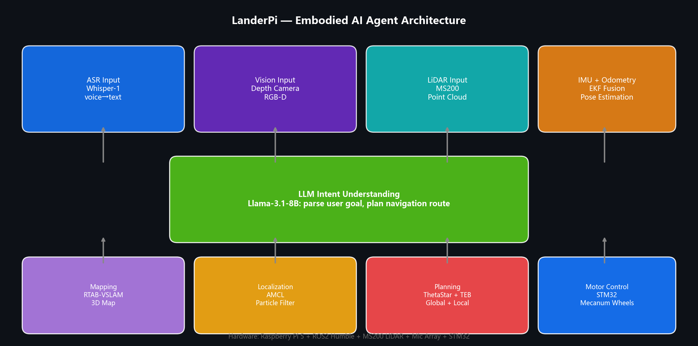

# LanderPi — Embodied AI Agent Robot



An **Embodied AI Agent** that understands voice commands, reasons via LLM, and autonomously navigates to destinations. Built on Raspberry Pi 5 + ROS2 Humble.

## Pipeline

```
Voice Input → ASR (Whisper-1) → LLM Intent Parse (Llama-3.1-8B) → Nav2 Autonomous Planning → Motor Control
```

## Hardware Stack

| Component | Model |
|-----------|-------|
| Main Board | Raspberry Pi 5 |
| LiDAR | MS200 |
| Depth Camera | RGB-D |
| Microphone Array | USB Mic Array |
| Motor Controller | STM32 |
| Chassis | Mecanum Wheel |

## Software Stack

- **ROS2 Humble** — Navigation2, AMCL, RTAB-VSLAM
- **Mapping**: RTAB-VSLAM 3D mapping
- **Localization**: AMCL (Adaptive Monte Carlo Localization) + EKF/IMU fusion
- **Planning**: ThetaStar (global) + TEB (local) + velocity smoothing
- **ASR**: OpenAI Whisper-1
- **LLM**: Llama-3.1-8B for intent understanding and task decomposition

## Key Achievements

- Full perception-to-action pipeline implemented and tested
- ~110 diagnostic and control scripts for integration debugging
- Resolved TF timestamp mismatch, AMCL lifecycle, FastDDS SHM issues on ARM
- Selected as Outstanding Course Design

## Repository

github.com/Hohbsham/LanderPi
