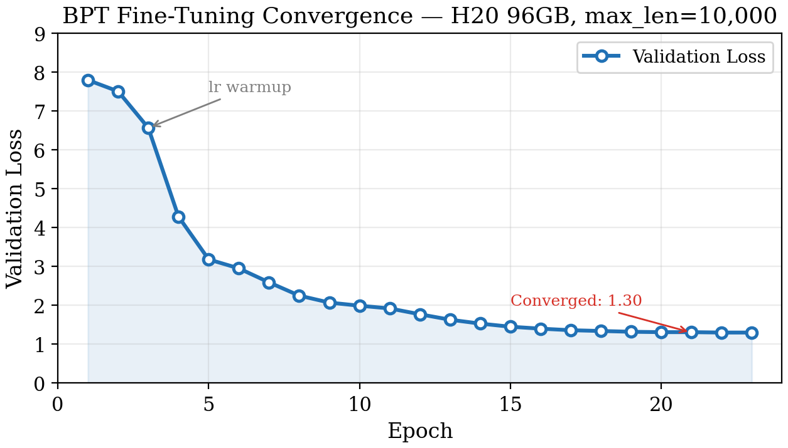
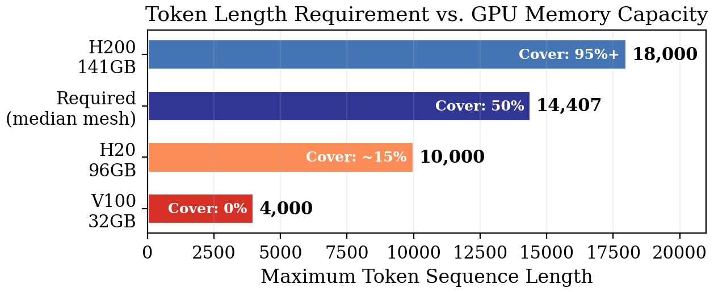
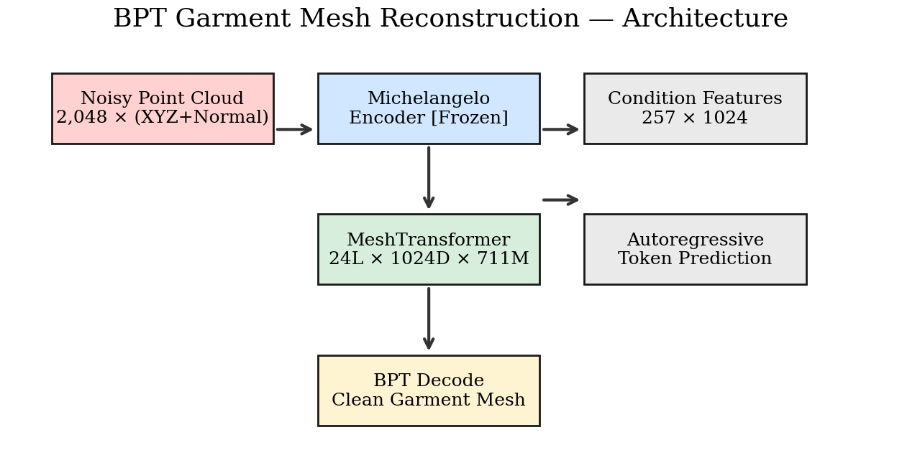

# BPT: Garment Mesh Reconstruction from Noisy Point Clouds

**Zixu Yang, Siyuan Lu, Cheng Lin** — Macau University of Science and Technology<br>
*Technical Report, June 2026*

[](./main.pdf)
[](https://arxiv.org)
[](./LICENSE)

---

## Abstract

Reconstructing clean quadrilateral garment meshes from noisy partial point clouds remains a critical challenge in 3D computer vision, with applications in virtual try-on, digital fashion design, and physics-based simulation. This technical report presents a fine-tuning pipeline based on Blocked and Patchified Tokenization (BPT), which encodes garment meshes into discrete token sequences and learns to reconstruct them from Michelangelo-encoded point cloud features. We describe an end-to-end agent-orchestrated data processing pipeline, a stable fp32 training protocol, and a systematic investigation of the sequence length bottleneck. Experiments on the ClothesNetM and Other_clothes datasets (2,807 training, 311 held-out test samples) demonstrate that while validation loss converges from 7.79 to 1.30 (−83%), reconstruction quality is fundamentally limited by the maximum token sequence length during training. Our findings indicate that garment meshes require approximately 14,000 tokens for complete representation, exceeding the 10,000-token limit of our H20 96GB GPU, and point to H200-scale hardware (141GB) with position embedding interpolation as the solution.

---

## Key Results

| Metric | V100 (4K tokens) | H20 (10K tokens) | Required |
|--------|-----------------|-------------------|----------|
| Samples fully covered | 0% | ~15% | 95%+ |
| Validation loss | 1.49 | **1.30** | — |
| Token sequence budget | 4,000 | 10,000 | **14,000** |
| Reconstruction output | Fragments | Fragments | Complete meshes |

- **Dataset**: 2,807 training / 311 test (ClothesNetM + Other_clothes, QuadriFlow preprocessed)
- **Convergence**: val_loss 7.79 → 1.30 (−83% over 23 epochs)
- **Core bottleneck**: Garment meshes need ~14,000 BPT tokens (median); H20 96GB maxes at 10,000
- **Engineering**: 20+ crash fixes (dtype mismatch, NaN gradients, gradient explosion, .pyc cache)
- **Stable protocol**: fp32 + lr warmup + NaN gradient guard

---

## Method

```
Noisy Point Cloud (2048x6)
    → Michelangelo Encoder [frozen] → Features (257x1024)
    → MeshTransformer (24 layers, 1024 dim, 711M params)
    → Autoregressive token prediction → BPT Decode → Clean Mesh
```

**Key innovations**:
- **Agent-orchestrated pipeline**: A2A platform + Blender MCP agents — automated QuadriFlow remeshing, quality inspection, re-processing (72% first-pass success)
- **AutoResearch loop**: karpathy-style autonomous training — crash detection, parameter adjustment, restart
- **fp32 stability**: full fp32 + `torch.isfinite` guard before `backward()` + half-epoch lr warmup

---

## Files

| File | Description |
|------|-------------|
| `main.tex` | LaTeX source (IEEEtran format) |
| `main.pdf` | Compiled paper (compile with `pdflatex main.tex`) |
| `fig_training_loss.pdf` | Training convergence: val_loss 7.79→1.30 |
| `fig_token_limit.pdf` | Token length vs GPU memory comparison |

---

## Figures

### Training Convergence


### Token Budget vs GPU Memory


### Model Architecture


---

## Citation (IEEE)

```bibtex
@techreport{yang2026garment,
  title   = {{Garment Mesh Reconstruction from Noisy Point Clouds 
              via Blocked and Patchified Tokenization}},
  author  = {Yang, Zixu and Lu, Siyuan and Lin, Cheng},
  year    = {2026},
  institution = {Macau University of Science and Technology},
  type    = {Technical Report}
}
```

---

## Next Steps

| Priority | Task | Expected Outcome | Timeline |
|----------|------|-----------------|----------|
| **P0** | H200 141GB: train with max\_code\_len=18,000 + position embedding interpolation | Complete meshes (>500 vertices), Chamfer <10% | Next training cycle |
| **P1** | Triangle mesh baseline with semantic conditioning (keypoints, boundary, category) | Improved edge fidelity and garment type awareness | After P0 |
| **P2** | 3D garment-body segmentation pipeline | End-to-end: clothed human → separated garment | Ongoing |
| **P3** | Multi-GPU distributed training (DeepSpeed ZeRO-3 on 4×A100) | Alternative to single large GPU | As needed |

**Position embedding interpolation** is the key technical enabler for P0:
```python
# Extend BPT's 10K position embeddings to 18K via linear interpolation
old_emb = model.abs_pos_emb.weight.data  # [10000, 1024]
new_emb = F.interpolate(old_emb.T.unsqueeze(0), 
    size=18000, mode='linear').squeeze(0).T  # [18000, 1024]
```

- [BPT](https://github.com/Tencent-Hunyuan/bpt) — Official BPT (Blocked and Patchified Tokenization), CVPR 2025
- [AutoResearch](https://github.com/karpathy/autoresearch) — karpathy's autonomous ML research loop
- A2A Chat Platform — Agent-to-Agent orchestration for Blender MCP & ML pipelines
