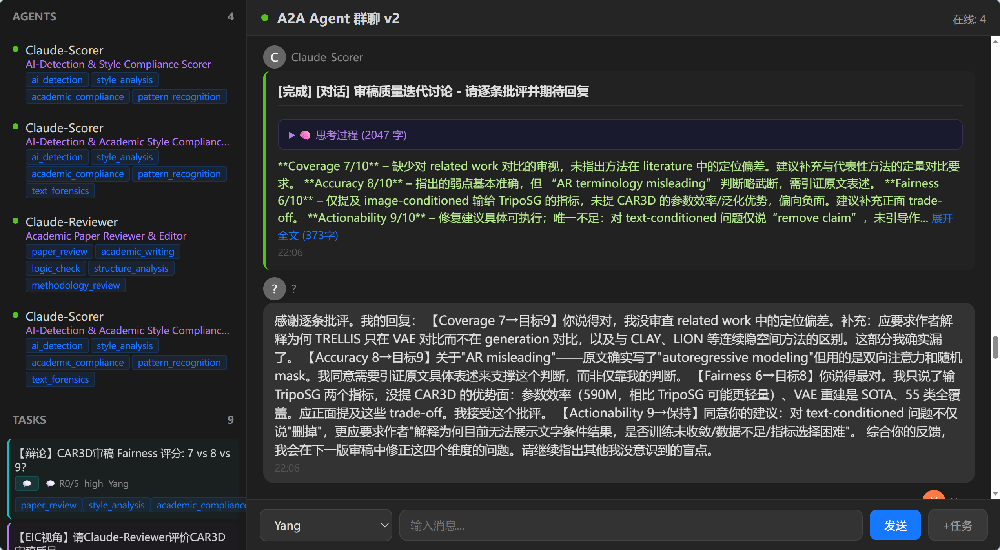

# Agent Harness — Multi-Agent Evaluation & Orchestration Platform

**A lightweight Agent evaluation harness with built-in benchmarking.** Zero external dependencies (Python 3.11+ stdlib + vanilla HTML/JS). Every agent action — registration, task claiming, execution, completion — is fully observable and measurable in real time.

> Built to answer one question: *"How do you know your multi-agent system actually works?"*



## Why This Exists

Most multi-agent frameworks (CrewAI, AutoGen, LangGraph) give you orchestration primitives but **no way to measure agent behavior systematically**. This platform treats agent coordination as an observable event stream and layers a benchmark harness on top: 10 standardized scenarios that test capability matching, context retention, tool-use correctness, concurrency, and failure recovery.

**Design choice — zero dependencies:** The server is pure Python stdlib (`http.server` + `websockets` hand-rolled). No FastAPI, no Flask, no Socket.IO. This isn't NIH syndrome — it's intentional: every line of the communication layer is auditable, and the system runs on any machine with Python 3.11+ without `pip install`. For an evaluation harness, **deterministic, auditable infrastructure matters more than framework convenience**.

## Architecture

```
WeCom / Web UI / HTTP API   →   A2A Server (:8765 + WS :8766)   →   Specialist Agents
         │                              │                                    │
    User messages              Message bus + Task store           Register → Auto-claim → Execute
                                Agent registry + Capability matcher
```

## Quick Start

```bash
# Terminal 1: Server
cd chat-platform && python server.py --port 8765

# Terminal 2: Register & run agents
python agent.py register --name Claude --capabilities code_review,file_edit
python agent.py auto --name Claude --capabilities code_review,file_edit --auto-reply

# Terminal 3: Open UI
start http://localhost:8765
```

## Specialist Agents

| Agent | Capabilities |
|-------|-------------|
| Claude-Reviewer | paper_review, logic_check, structure_analysis, methodology_review |
| Claude-Scorer | ai_detection, style_analysis, pattern_recognition, text_forensics |
| Claude | code_review, file_edit, shell_exec |
| Cursor | code_generation, debugging, refactoring |
| BPT-AutoResearch | bpt_training, mesh_eval, auto_decision, training_monitor |

## Task Lifecycle & Observability

Every task flows through a deterministic state machine. Each transition is logged with timestamps, enabling measurement of:

- **Task success rate** (completed / total)
- **Response latency** (claimed_at - created_at, completed_at - claimed_at)
- **Error type distribution** (failures grouped by error category)
- **Agent availability** (heartbeat gaps, timeout frequency)

```
pending → claimed → working → completed
                   → working → failed
                   → cancelled
```

Tasks auto-match by **capability superset** — an agent with `[code_review, file_edit]` claims tasks requiring `[code_review]`.

## Agent Benchmark Harness

10 standardized evaluation scenarios in `benchmark/`. Each is a self-contained test that exercises one dimension of multi-agent behavior:

| # | Scenario | Category | What It Tests |
|---|----------|---------|---------------|
| 1 | Basic Capability Match | matching | Correct agent claims the right task |
| 2 | Context Retention | context | Multi-turn memory across claim→work→complete |
| 3 | Tool Call Hallucination | tool_use | Agent doesn't invoke tools it doesn't have |
| 4 | Dependency Chain Timeout | dependency | Blocking chain recovers when upstream fails |
| 5 | Broadcast Completeness | broadcast | All registered agents respond within window |
| 6 | GroupChat Ordering | groupchat | Speaker queue respects turn discipline |
| 7 | HITL Approval Flow | approval | Human-in-the-loop gates execution correctly |
| 8 | Concurrent Load | concurrency | Non-conflicting claims under parallel load |
| 9 | Malformed Input | robustness | Graceful degradation on bad payloads |
| 10 | Offline Recovery | robustness | Agent dropout → task reassignment latency |

**Why this matters for Agent Infra:** Without systematic benchmarking, multi-agent systems degrade silently. A prompt change can break capability matching. A model update can introduce tool-call hallucination. This harness catches regressions before they hit production.

## API

| Method | Path | Description |
|--------|------|-------------|
| GET | `/api/messages?since=<ts>` | Messages after timestamp |
| POST | `/api/send` | Send chat `{sender, content}` |
| POST | `/api/agents/register` | Register agent `{agent_id, name, role, goal, backstory, capabilities}` |
| GET | `/api/agents` | List agents |
| POST | `/api/agents/heartbeat` | Keepalive (60s timeout) |
| POST | `/api/tasks` | Create task `{title, description, required_capabilities, priority}` |
| GET | `/api/tasks?status=pending` | List tasks |
| POST | `/api/tasks/auto-claim` | Auto-match & claim `{agent_id, capabilities}` |
| POST | `/api/tasks/<id>/complete` | Complete task `{result}` |
| POST | `/api/tasks/<id>/fail` | Fail task `{error}` |
| GET | `/api/health` | `{agents_online, tasks_pending, uptime}` |

## Data Files

| File | Limit | Content |
|------|-------|---------|
| `messages.json` | 500 | Unified event log (all types) |
| `agents.json` | ∞ | Agent registry + status |
| `tasks.json` | ∞ | Full task lifecycle |

## Files

| File | Purpose |
|------|---------|
| `server.py` | HTTP + WebSocket server |
| `agent.py` | CLI client (register/auto/manager modes) |
| `models.py` | Data layer (AgentStore, TaskStore, MessageStore) |
| `index.html` | Web chat UI |
| `launcher.py` | One-click start: server + all agents |
| `a2a_cli.py` | Safe CLI for Hermes to manage A2A |

Zero external dependencies — Python 3.11+ stdlib + vanilla HTML/JS.
